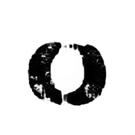

# Text-To-Image Font Generation Results using GALIP 
## Sample results

<b>Generated Images

    Prompt:  A lowercase a which has traits blockyand properties black square sans serif static extended all caps
    

    Prompt:  A lowercase e which has traits outdoors childlikeand properties regular rounded sans serif static regular mixed caps
    

    Prompt:  A lowercase x which has traits scuffed army dirtyand properties black rounded sans serif static extended all caps.png
    

    Prompt:  An uppercase H which has traits alien comicand properties regular rounded sans serif static regular mixed caps.png
    

    Prompt:  An uppercase Z which has traits groovy hippie seventiesand properties black rounded serif dynamic extended all caps.png
    

    Prompt:  An uppercase O which has traits scuffed army dirtyand properties black rounded sans serif static extended all caps
    

    Prompt:  A lowercase f which has traits comic schooland properties black rounded sans serif static extended all caps
    

    Prompt:  A lowercase k which has traits rainforestand properties regular square sans serif dynamic regular all caps
    

    Prompt:  A lowercase r which has traits childlikeand properties regular rounded sans serif static regular mixed caps
    

    Prompt:A lowercase s which has traits handwritten stenciland properties black rounded sans serif static regular all caps
    

